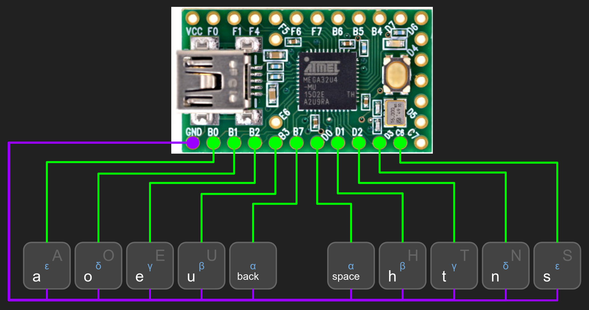

# ten key keyboard

This is my ten key keyboard. I want to type and mouse anywhere, on any surface, and this seems like a necessary step. After I came up with the layout, someone pointed me towards the [asetniop](http://asetniop.com) layout, but by then this was stuck in my head. In any event, this is my first attempt at building my own keyboard, and I have absolutely no idea what I'm doing. This is based on TristanTrim's [asetniop-keyboard](https://github.com/TristanTrim/asetniop-keyboard), but obviously with two more keys.

 ... the bottom row are the physical keys. But, hold any key and it activates the virtual row corresponding to the greek letter in blue; tap any key while still holding, and you get the corresponding key on the virtual row. So, tapping the 't' key gives you a 't'. But holding the 't' key activates the gamma row, so if you then tap your left pinky (the physical 'a' key) you get a minus ('-') character. No idea whether this will allow graceful typing; gotta build it first!

 ... with a Teensy 2.0.

... need to edit below here ...

## Installation
Keys are wired up directly to the pins D0 - D7. There are ways to do this that would save pins, but I like this method because it's easy, and I don't need the extra pins for anything.

If you're on linux like me you may want to use the [bootloader](https://github.com/PaulStoffregen/teensy_loader_cli)

    sudo ./teensy_loader_cli/teensy_loader_cli --mcu=atmega32u4 asetniop.hex -w

Otherwise you'll have to flash the firmware some other way. Message me if you don't know how and I'll try to help you out.

## Bill of materials

 - [A teensyduino 2.0 board.](https://www.pjrc.com/store/teensy.html)
 - A 3D printed copy of each of the [.stl files.](https://github.com/TristanTrim/asetniop-keyboard/tree/master/printed_parts)
 - [8 Keyswitches](https://mechanicalkeyboards.com/shop/index.php?l=product_detail&p=708)
 - [8 Keycaps](http://www.wasdkeyboards.com/index.php/products/blank-keycap-singles/row-2-size-1x1-cherry-mx-keycap.html) (if you're not printing them)
 - wire and solder tools.
 - M3 nuts and bolts for the case.

## Typing guide

If you want to start learning about typing with this style of chorded keyboard, you can use the asetniop [online demo](http://asetniop.com/try/tablet/) to start learning asetniop in your web browser using your qwerty keyboard. This way you can find out what its like to type with a chorded keyboard without needing to do anything radical like building a keyboard.

There are a number of additions to the asetniop chords to expand this project into a more general keyboard. Also my keyboard only has eight keys, so doesn't use the thumbs at all. I'll explain below.

For the purpose of this guide I'm representing chords with a series of '.'s and '#'s. The '#'s represent a key being pressed down, and the '.'s a key left unpressed. Read from left to right the keys represented are the left pinky key through to the right pinky key.

### Numbers
The numbers all use .### on the left as somewhat of a prefix, and then follows a binary sequence from 0 to 9.

    .### .... : 0
    .### ...# : 1
    .### ..#. : 2
    .### ..## : 3
    .### .#.. : 4
    .### .#.# : 5
    .### .##. : 6
    .### .### : 7
    .### #... : 8
    .### #..# : 9

### Arrow keys
Like with the numbers the arrow keys use a 'prefix'. They all start with the 'w' key; ##..

    ##.. ...# : up
    ##.. ..## : down
    ##.. ..#. : left
    ##.. .#.. : right

### Non-alphanumeric
The non-alphanumeric keys were some of the first I wanted for interacting with my computer. The way the 'ctrl', 'shift', 'alt', and 'mod/window' keys work is that you press the chord, and then it is applied to the next chord that is pressed. For example, to get a '?' you would press #### ..#. and then press #... ...#

    #### ...# : ctrl
    #### ..#. : shift
    #### .#.. : alt
    #### #... : mod/window
    .... #### : space
    ...# #### : enter
    ###. .... : tab
    #### .... : esc

The rest of the keys may be a bit confusing, because I didn't add chords for anything that would normally be accessed by pressing shift+'some key'. So, for example, to use a '!' you need to press the chord for shift followed by the key for 1. because of this it's important to remember where all the symbols are on the qwerty keyboard. (assuming you want to use them.)

Of the rest of the keys, some of them may be in the original asetniop, and others I may have added or changed. I don't really remember which is which, sorry.

    .... ##.# : [
    .... #.## : ]
    #... ...# : /
    #... ..#. : \
    #... #### : `
    ..#. ..#. : -
    ..#. ..## : =
    
## Random nonsense

 - [x] Chord started before previous chord released separation. Now you can press ..#. ...., ..## ...., ..#. ... for "ere". Play around with it.
 - [ ] multibackspace: undo as many keypresses as were sent on the last chord release, for example if you type "ere" when you meant "r" backspace 3 times is useful.
 - [ ] Improved circuit design to use 3 rather than 5 wires to the keys. Then chinsy audio cables could be used!
 - [ ] abandon wired and write this on a bluetooth platform
 - [ ] macro functionality.
 - [ ] saving & dumping macros.
 - [ ] some kinda ml for separating chords, cause I type "ere" a lot, but not "sds" so much.

blah blah blah

I'd like to add the rest of the keys on a standard keyboard, and maybe some special function keys, but I'm not sure when I'll get around to it.

Further down the line I would like to experiment with adding joystick / mouse functionality, and building a wireless pair.

Or abandoning this and making a pair that maps the fingers onto a ternary, rather than binary, system. You know, for the 3 positions ^ 10 fingers = 59049 chords, rather than the 2 positions ^ 8 fingers = 256 chords availiable on my current system. If I assume 12 axes because the thumbs move in two axes so nicely that gives me: 3 positions ^ 12 axes = 531441. That's 3 positions ^ 6 axes = 729 chords on one hand! The trouble then would never be space, but figuring out how to organise all the chords. Ok, it would probably still be space at some point, because who wants to be stuck with a vocabulary of just over half a million. So lame right?

